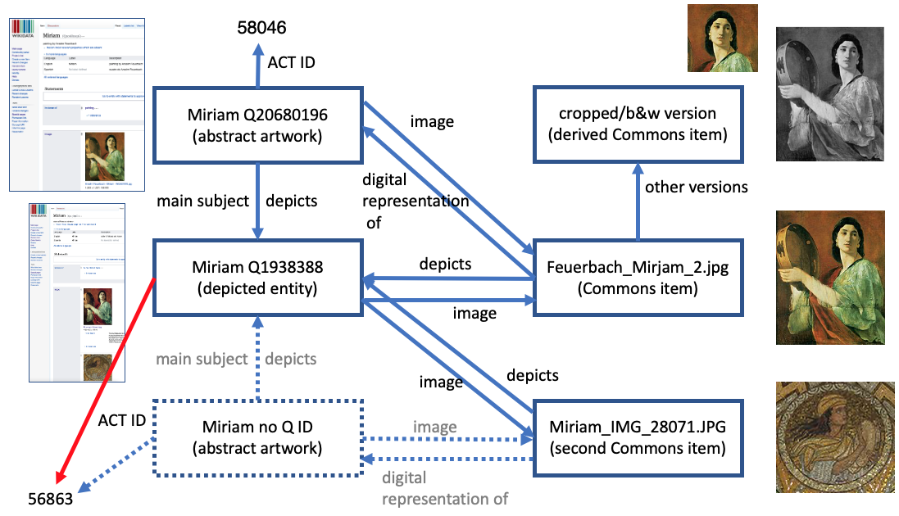

# ACT Wikidata project notes

## Model

## Purpose and sources of files in this directory

**cleaned_output.csv** This was a cleanup of the output of the fall 2021 version of the script [act.ipynb](https://github.com/HeardLibrary/vandycite/blob/master/act/act.ipynb), which used a SPARQL search of Wikidata to try to match ACT items with Wikidata items using the names of the Commons items in the rights field of the ACT database metadata export. The original export was cleaned up by part of the act.ipynb script by dereferencing all of the Commons URLs and removing images that were no longer in commons (see file images_removed_from_commons.csv).  After doing the query and outputting the data, images that duplicated other images because they were crops or black and white versions were removed (see file duplicates_of_existing_commons_ids.csv). NOTE: a derivative of this file, add_to_wikidata.csv was used as input for acquiring existing Commons data. 

**images_removed_from_commons.csv** This was a bi-product of the [act.ipynb](https://github.com/HeardLibrary/vandycite/blob/master/act/act.ipynb) script (see above) that was created from 404 (not found) responses captured by the script. They were manually dereferenced and these were the ones whose page said they had been removed.

**duplicates_of_existing_commons_ids.csv** Hand curated. These were discovered manally, mostly by Charlotte. Ultimately, they should be linked to the primary Commons page for an abstract artwork (to which the Wikidata item is linked) rather than having their own Wikidata item.

**add_to_wikidata.csv** This file is a derivative of cleaned_output.csv and consists of all of the rows for works that do not already have Wikidata items (ACT items already in Commons). This file is the input of further processing by the [commons_data.ipynb](https://github.com/HeardLibrary/linked-data/blob/master/commonsbot/commons_data.ipynb) in the Linked Data repository. 

**nonstandard_commons_fields.csv** This file was generated as a by-product of scraping the Commons item web pages with the script [commons_data.ipynb](https://github.com/HeardLibrary/linked-data/blob/master/commonsbot/commons_data.ipynb) in the Linked Data repo, commonsbot folder. It contains the field names, values, and Commons item for non-standard properties that were not captured by the script (and therefore essentially represent lost information). This should probably looked through to see if there is any important information that needs to be manually added outside of a process that uses the scraped templated data table.

**templated_data_to_wikidata.csv** This file is the main product of scraping the Commons item web pages with the script [commons_data.ipynb](https://github.com/HeardLibrary/linked-data/blob/master/commonsbot/commons_data.ipynb) in the Linked Data repo, commonsbot folder. It contains all of the standard data fields that are used for artwork or general works according to their templates, plus other fields that were found empirically to have been used a significant amount of the time. After appropriate cleaning and disambiguation, at least some of these data will probably be pushed to Wikidata when we create new items for works that are already in Commons.

**test_output_commons_api.csv** This was the result of a test to see what kind of metadata I could get using the Commons API. (script: [commons_data.ipynb](https://github.com/HeardLibrary/linked-data/blob/master/commonsbot/commons_data.ipynb) in the Linked Data repo, commonsbot folder.) I pretty much gave up on it because the data were really dirty and it seemed like I could much more effectively get most of the same data by scraping the metadata tables on the Commons image pages. The one thing this script provides is the Wikibase ID, which would be necessary to push structured data to Commons images.

**found_in_wikidata_different_commons_names.csv** These data were generated by a part of the script [commons_data.ipynb](https://github.com/HeardLibrary/linked-data/blob/master/commonsbot/commons_data.ipynb) that scraped the web pages for Commons items that were not matched to Wikidata by SPARQL but that had Wikidata links on their Commons web pages. Generally, this means that there are multiple Commons files (each with their own filename) for a particular abstract work, and the Commons file linked to the Wikidata item is not the one that ACT used. This is significant, because it means that these Commons items should not have Wikidata items created for them. Rather, a single Commons item should be linked to the Wikidata item and the other "duplicate" Commons images should be linked to the primary Commons item page.

