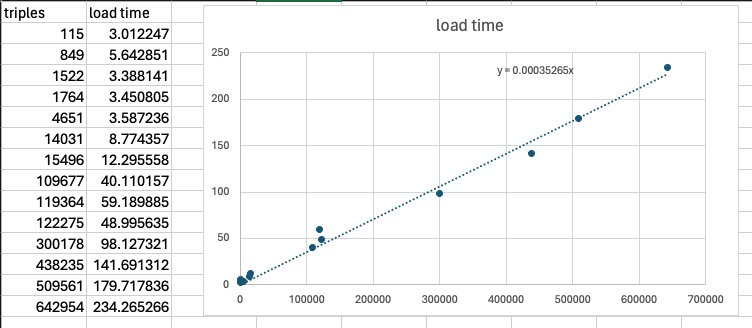
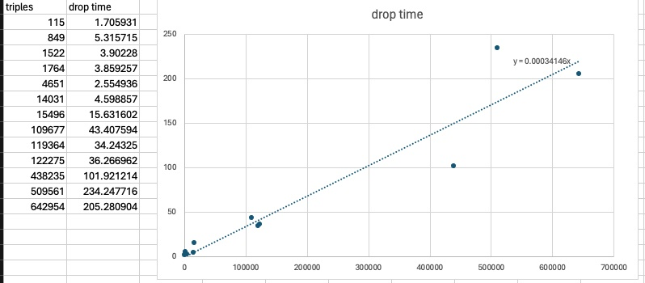

# Neptune loader

## Time to load big files

The load time for files seems to depend primarily on the number of triples to be loaded.

For unknown reasons, Neptune does not respond to the client when loading files larger than about a million triples (load time about 350 s), even though it completes the load as long as its load time does not exceed the Neptune timeout setting. So it is not possible to know when the load has completed by viewing the log file, since it is updated when a response is received from the server. An alternative way to check if the graph has completed its loading is to perform a SPARQL query. If the graph IRI is returned in the query results, then the graph has been loaded. 

With a timeout setting of 15 minutes (900 s), Neptune should be able to load files containing up to a little fewer than 2.5 million triples. This is consistent with empirical data showing that files containing 2.35 million triples did not load, while files containing 1.62 million triples and 1.41 million triples did load. 

## Time to drop graphs

The time to drop graphs seems to be linear with the number of triples in the graph and is very similar to the load time. So it takes roughly as long to drop a graph as it does to load it.

## Practical implications of load and drop times

Because AWS Lambda functions have a maximum execution time of 15 minutes, the cumulative load times for all graphs is limited. If the graphs already exist and must first be dropped before the updated graphs are loaded, then the cumulative load time can't be longer than about 7 minutes (there is also some overtime for writing files and additional triples). If the graphs are new and no pre-existing graphs need to be dropped, then the cumulative load time can't be longer than about 14 minutes.

Any individual files containing more than about 700 000 triples should be loaded separately, since the script will not be able to proceed with loading additional files without a response from Neptune. Because a lack of response from Neptune prevents the generation of metadata about the loaded graph, after loading larger files, the script should be re-run with the same `graph_file_associations.csv` and `named_graphs.csv` files using the `metadata` command to generate the metadata. 

Files larger than about 700 000 triples that are replacing previously loaded graphs must be dropped as a separate operation prior to loading the new graphs, since the drop time is too long to get a response from Neptune and the script will not be able to proceed with loading the new file. Performing a drop-only operation can be done using the `drop` command.

